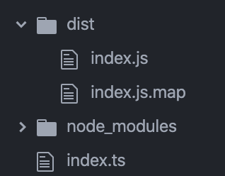

## What is typescript?
- Gets transformed into javascript before runtime
- Supports all features of javascript and more ("superset" of javascript)
- **Adds static typing to javascript**

## Static vs dynamic typing
- In javscript variables have types (number, string, array, boolean)
- And with **dynamic typing**, you don't have to say what they are
- Javascript will take what it's given and figure it out
- For example this `subtract` function
```
function subtract(a, b) {
    return a - b;
}
subtract(5, 3); // Returns 2
subtract('happy', 'cat'); // Returns NaN
subtract(['orange', 'apple'], ['banana']); // Returns NaN
```
- But this function only makes sense to call on numbers
- Anything else will likely causes problems
- This is where **static typing** is very useful
- With Typescript, we can say that this function should only be called with numbers
```
function subtract(a: number, b: number): number {
    return a - b;
}
```
- So we can call it with numbers like we should
```
subtract(5, 3); // Returns 2
```
- But if we call it with something that's not a number
```
subtract('happy', 'cat');
```
- Then compiling the typescript will fail
```
index.ts:15:10 - error TS2345: Argument of type '"happy"' is not assignable to parameter of type 'number'.
15 subtract('happy', 'cat');
```
- This lets you catch your mistakes early and removes the hazard of this happening at runtime and causing an error for the user

## How does typescript work with javascript?
Don't need to focus too hard on these details as it will likely already be setup in your codebases
- It gets transformed into javascript before runtime
- Transformed typescript will be put in the folder defined as `outDir` in `tsconfig.json`
```
{
  "compilerOptions": {
    "module": "commonjs",
    "esModuleInterop": true,
    "target": "es6",
    "moduleResolution": "node",
    "sourceMap": true,
    "outDir": "dist"
  },
  "lib": ["es2015"]
}
```
- Running the `tsc` in command line will compile typescript files and transform them javascript then put the result in `outDir`


- These files in `dist/` is what will be run

## Ways to declare types
When defining a variable
```
let isDone: boolean = false;
```

When defining a function you can specify the type of parameters and return value
```
function strLength(a: string):number {
  return a.length;
}
```

Use `void` as the return value if the function doesn't return anything
```
function log(val: string): void {
    console.log(string);
}
```

## Types of Typescript
##### boolean
```
let isDone: booelan = false;
```

Ex `true`, `false`

##### number
```
let x: number = 5;
```
Ex `5`, `512`, `-2`, `NaN`

##### string
```
let inputValue: string = 'i love butterflies';
```
Ex `'abc'`, `'cows in berkeley ?!'`, `''`

##### array
Must specify the type of the values when defining an array
```
let nums: number[] = [1, 2, 3, 5];
let words: string[] = ['i', 'love', 'butterflies'];
```
Can use type `any` when the array contains a mixture of types
```
let values: any[] = ['cats', 4, true];
```

## any
Type `any` is like a wildcard type that will pass through any compile checks

Using type `any` is like being in Javascriptland

```
let x: any = true;
x = 'please';
x = 5;
```

- It's useful when working with existing Javascript code that do not specify type.
- Can be useful when defining an array that will have values of different types

## Generic Types
Generic types are a way to define the type relationship between parameters or return values without knowing exactly what type they will be.

This function `preferFirst` will take two arguments of the same type (which we are notating as T) and return a value of that same type
```
function preferFirst<T>(a: T, b: T): T {
    return a || b;
}
```
It can be called with two numbers, returning another number
```
preferFirst(1, 2); // Returns 1
```
Or also with two strings, returning another string
```
preferFirst('gold', 'finch'); // Returns 'gold'
```
But if you try to call it with one string and one number the compiler will error
```
preferFirst('gold', 4); // Errors on compile
```

## Type assertions
Allows you to tell the compiler that this variable is a different type than it is currently thinks it is

## Interfaces
You can make your own types by defining Interfaces
```
interface Cat {
    age: number,
    isHungry: boolean,
    name?: string, // use ? for optional properties
}
```
These can be used like any other type
```
let puss: Cat = {age: 10, isHungry: true};

function askForFoodIfHungry(cat: Cat): void {
    if (cat.isHungry) console.log('meowwwww');
}

interface Household {
    numResidents: number,
    cat: Cat,
}
```

## Resources
